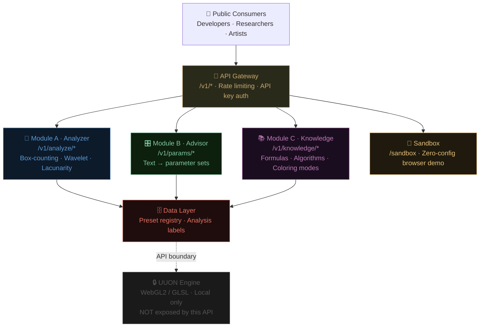

# uuon-fractal-api

**Mathematical fractal analysis + parameter advisory API.**  
Companion to [`uuon-cloud-api`](https://github.com/uuonnouu).  
Built on research by [UUON Foundation Inc.](https://uuonfoundation.com) · Phillip A. Ruiz III

**Live Demo:** [uuon-fractal-api Explorer](https://claude.ai/public/artifacts/a0e0dae9-ddb6-46c8-84c2-cac796913707)  
**Repo:** [github.com/uuonnouu/uuon-fractal-api](https://github.com/uuonnouu/uuon-fractal-api)

-----

## Why This Exists

The [UUON Fractal Engine](https://uuonfoundation.com) is a WebGL2/GLSL renderer
whose source is proprietary. This API exposes only the **mathematical layer** —
fractal dimension measurement, parameter recommendations, and a formula knowledge
base — giving developers a fully testable surface without touching the rendering IP.

If the engine is the product, this API is the taste.

-----

## Architecture



-----

## Quick Start (under 60 seconds)

### Docker

```bash
git clone https://github.com/uuonnouu/uuon-fractal-api
cd uuon-fractal-api
docker compose up
```

Docs at **<http://localhost:8080/docs>** · Sandbox at **<http://localhost:8080/sandbox>**

### Python direct

```bash
pip install -r requirements.txt
python uuon_fractal_api_main.py
```

### Test it

```bash
pip install pytest httpx
pytest tests/test_api.py -v
```

-----

## Modules

### Module A · Fractal Analyzer

```bash
curl -X POST http://localhost:8080/v1/analyze/full \
  -H "Content-Type: application/json" \
  -d '{"image": "<base64>", "methods": ["box_counting","wavelet","lacunarity"], "ensemble": true}'
```

Returns fractal dimension Df with confidence score across three methods.

**Endpoints**

```
POST /v1/analyze/full       — All methods + weighted ensemble
POST /v1/analyze/dimension  — Box-counting only
POST /v1/analyze/lacunarity — Lacunarity only
GET  /v1/analyze/methods    — Method catalog with formulas
```

-----

### Module B · Parameter Advisor

```bash
curl -X POST http://localhost:8080/v1/params/recommend \
  -H "Content-Type: application/json" \
  -d '{"description": "dark organic spiral coloring book", "constraints": {"coloring_book_mode": true}}'
```

Returns UUON engine parameter set from plain language description.

**Endpoints**

```
POST /v1/params/recommend  — Text → parameter set
GET  /v1/params/schema     — Full schema, ranges, valid values
POST /v1/params/validate   — Validate a parameter set
```

-----

### Module C · Knowledge Base

```bash
curl http://localhost:8080/v1/knowledge/generators/5
curl http://localhost:8080/v1/knowledge/algorithms/wavelet
curl http://localhost:8080/v1/knowledge/coloring-modes
```

-----

### Sandbox

Zero-config browser demo. No API key required.

```
GET /sandbox
```

-----

## Testing

```bash
pip install pytest httpx Pillow numpy
pytest tests/test_api.py -v
```

Covers all three modules — 20+ tests across analyzers, advisor, knowledge base,
rate limiting, sandbox, and attribution.

-----

## Licensing

|Tier      |Requests |Key        |Commercial|
|----------|---------|-----------|----------|
|Free      |20/day   |No         |No        |
|Explorer  |500/day  |Free signup|No        |
|Commercial|Unlimited|Paid       |Yes       |

Contact: **[phi1@uuonfoundation.com](mailto:phi1@uuonfoundation.com)**

-----

## Preset Catalog

**[SHOWCASE.md](./SHOWCASE.md)** — 8 named presets with mathematical descriptions  
**[presets.json](./presets.json)** — machine-readable parameter sets

-----

## Contributing

See **[CONTRIBUTING.md](./CONTRIBUTING.md)** — 5 open issues tagged `good first issue`.

The hard rule: this API must never expose engine rendering logic. All contributions
operate on parameter schemas, pixel data, or mathematical literature — not GLSL source.

-----

## Related

- [UUON Fractal Engine](https://uuonfoundation.com) — the WebGL2 renderer this API supports
- [uuon-cloud-api](https://github.com/uuonnouu) — companion cloud API
- [@uuon.foundation](https://instagram.com/uuon.foundation) — Instagram

-----

*UUON Foundation Inc. · Phillip A. Ruiz III · [phi1@uuonfoundation.com](mailto:phi1@uuonfoundation.com)*