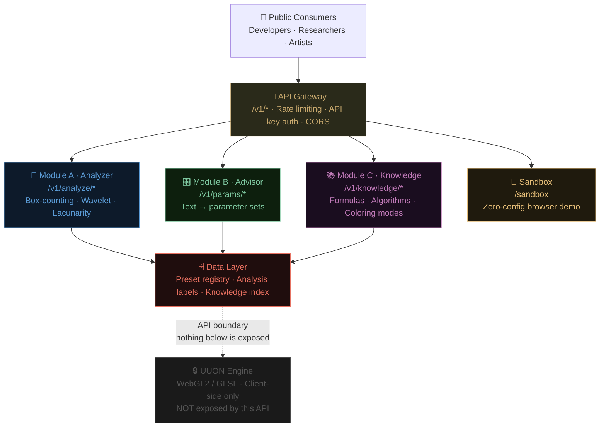

# uuon-fractal-api

**Mathematical fractal analysis + parameter advisory API.**  
Companion to [`uuon-cloud-api`](https://github.com/uuon-foundation/uuon-cloud-api).  
Built on research by [UUON Foundation Inc.](https://uuonfoundation.com) · Phillip A. Ruiz III

-----

## Why This Exists

The **Live Demo:** [uuon-fractal-api Explorer](https://claude.ai/public/artifacts/8e30f036-d6b9-488d-96f4-26341c357b7f is a WebGL2/GLSL renderer whose source is proprietary.
This API exposes only the **mathematical layer** — fractal dimension measurement, parameter recommendations, and a formula knowledge base — giving developers a fully testable, documented surface without touching the rendering IP.

If the engine is the product, this API is the taste.

-----

## Architecture



-----

## Quick Start (under 60 seconds)

### Docker (recommended)

```bash
git clone https://github.com/uuon-foundation/uuon-fractal-api
cd uuon-fractal-api
docker compose up
```

Open **<http://localhost:8080/sandbox>** — live demo, no key required.  
Interactive docs at **<http://localhost:8080/docs>**.

### Python direct

```bash
pip install -r requirements.txt
python uuon_fractal_api_main.py
```

### Replit

Fork the Replit template → Run.  
`.replit` and `requirements.txt` are pre-configured.

-----

## Modules

### Module A · Fractal Analyzer

Accepts any image (PNG/JPEG as base64). Returns fractal dimension metrics using three methods plus a weighted ensemble.

```bash
# Analyze an image
curl -X POST http://localhost:8080/v1/analyze/full \
  -H "Content-Type: application/json" \
  -d '{"image": "<base64>", "methods": ["box_counting","wavelet","lacunarity"], "ensemble": true}'
```

**Response (abbreviated):**

```json
{
  "results": {
    "box_counting": { "Df": 1.743, "r_squared": 0.991 },
    "wavelet":      { "Df": 1.761, "energy_ratio": 0.887 },
    "lacunarity":   { "mean_lacunarity": 0.285, "heterogeneity": "moderate" },
    "ensemble":     { "Df": 1.754, "confidence": 0.94 }
  }
}
```

**Endpoints**

```
POST /v1/analyze/full        — All methods + ensemble
POST /v1/analyze/dimension   — Box-counting only
POST /v1/analyze/lacunarity  — Lacunarity only
GET  /v1/analyze/methods     — Method catalog with formulas
```

-----

### Module B · Parameter Advisor

Natural language description → UUON engine parameter set. Exposes parameter names and ranges — no GLSL, no rendering math.

```bash
curl -X POST http://localhost:8080/v1/params/recommend \
  -H "Content-Type: application/json" \
  -d '{"description": "dark organic spiral, coloring book ready", "constraints": {"coloring_book_mode": true}}'
```

**Response (abbreviated):**

```json
{
  "recommended_parameters": {
    "generator": 5,
    "generator_name": "sin(z) + c",
    "coloring_mode": 8,
    "coloring_mode_name": "Distance estimate",
    "contrast": 1.2
  },
  "confidence": 0.81,
  "style_match": ["dark","organic","coloring_book"]
}
```

**Endpoints**

```
POST /v1/params/recommend   — Text description → parameter set
GET  /v1/params/schema      — Full schema with types, ranges, valid values
POST /v1/params/validate    — Check if a parameter set is valid
GET  /v1/params/presets     — Named preset registry
```

-----

### Module C · Knowledge Base

Queryable index of UUON fractal knowledge — generator formulas, coloring mode descriptions, dimension algorithm catalog.

```bash
curl http://localhost:8080/v1/knowledge/generators/5
curl http://localhost:8080/v1/knowledge/algorithms/wavelet
curl http://localhost:8080/v1/knowledge/coloring-modes
```

-----

### Sandbox

Zero-config browser demo. Generates a synthetic Mandelbrot image server-side, runs the full analysis pipeline, renders results live. No API key required.

```
GET /sandbox
```

-----

## Licensing

|Tier      |Requests |Key Required     |Commercial Use|
|----------|---------|-----------------|--------------|
|Free      |20/day   |No               |No            |
|Explorer  |500/day  |Yes (free signup)|No            |
|Commercial|Unlimited|Yes (paid)       |Yes           |

Attribution required on all free-tier derivative works.  
Contact for commercial license: **[phi1@uuonfoundation.com](mailto:phi1@uuonfoundation.com)**

-----

## ML Value

Every API call accumulates structured data usable as ML training labels:

|Field                       |Use                                             |
|----------------------------|------------------------------------------------|
|`df_ensemble`               |Ground-truth fractal dimension per image        |
|`lacunarity_mean`           |Texture heterogeneity classification label      |
|`confidence`                |Filters low-quality training samples            |
|`parameter_set + style_tags`|Semantic style → parameter mapping training data|
|`coloring_book_score`       |Printability classifier labels                  |

-----

## Contributing

See <CONTRIBUTING.md> for open issues tagged `good first issue`.

The architectural constraint for all contributions: **this API must never expose engine rendering logic.** All modules operate on parameter schemas, image pixel data, or mathematical literature — not GLSL source.

-----

## Related

- [`uuon-cloud-api`](https://github.com/uuon-foundation/uuon-cloud-api) — companion cloud API
- [UUON Fractal Engine](https://uuonfoundation.com) — the WebGL2 renderer this API supports
- [uuonfoundation.com](https://uuonfoundation.com) — main site

-----

*UUON Foundation Inc. · Phillip A. Ruiz III · [phi1@uuonfoundation.com](mailto:phi1@uuonfoundation.com) · @uuon.foundation*